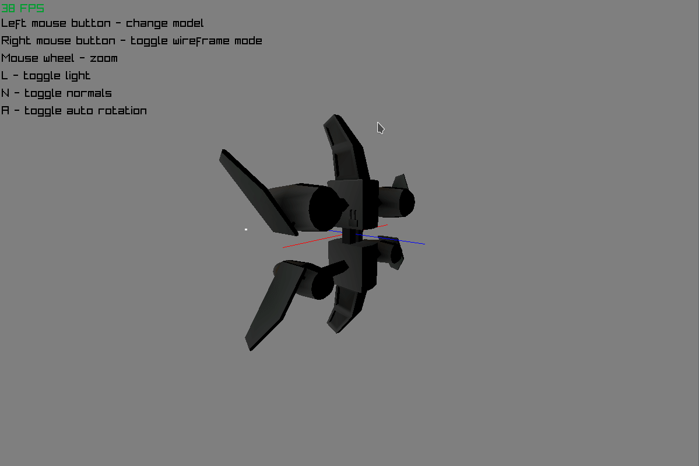

# go-3d-rasterizer

This is just a very basic 3d rasterizer written in Go.

The [raylib-go](https://github.com/gen2brain/raylib-go) library has been used to create a window and draw a framebuffer on it.    
Everything else has been implemented manually.

The purpose of this project was to learn the basics of 3d rendering.    
This is by no means a finished or optimal solution.

I chose a simple model format for 3d models - namely, Wavefront Obj.    
The parser I wrote is incomplete - it only needed to satisfy the purpose of rendering a basic model.    
Data which the rasterizer does not use, like certain material attributes, have been ignored alltogether.

The triangle rasterization algorithm, which is the core of all of this, can be found in:    
[rasterizer/rasterizer.go](rasterizer/rasterizer.go)

I used free models from [TurboSquid](https://turbosquid.com)

No testing has been done, use at your own risk :)

## build

just run

    go build
    
in the root folder and Go will fetch the dependencies (raylib) and build the executable!

## preview

